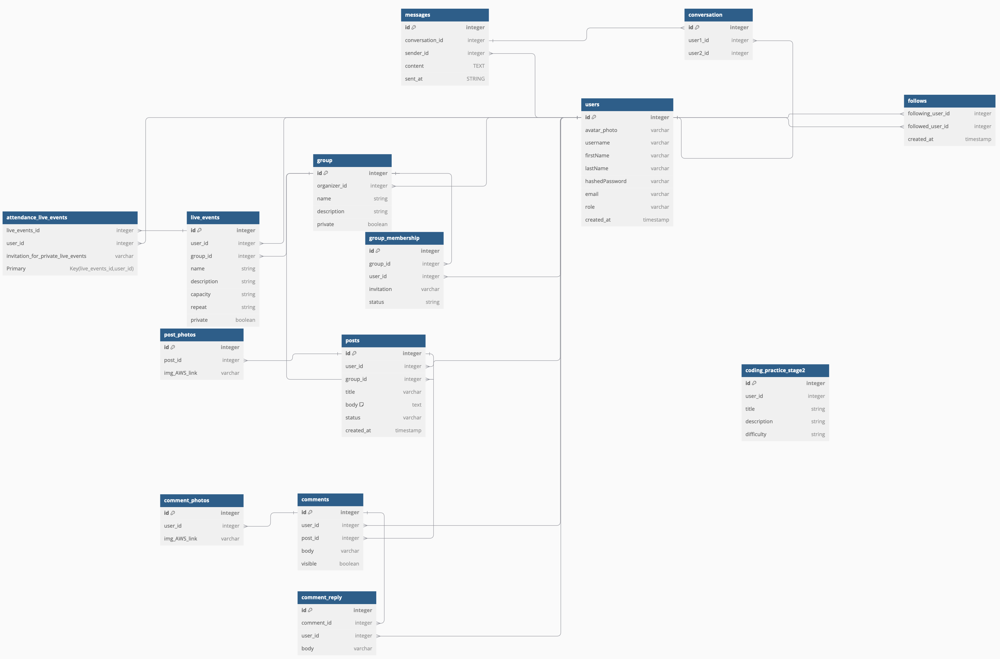
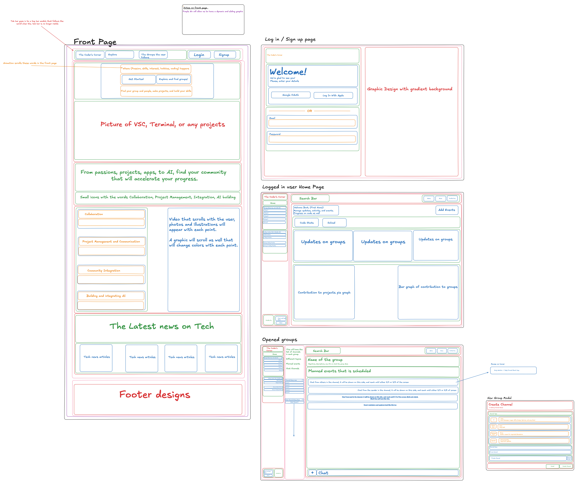

# Community Page
## Salutations!
This is a full-stack project. This project has CRUD of several website features, Groups, Events, and there associated images.

## Backend
- Express
- Express-Validator
- Sequelize
- JWT
- WebRTC
- AWS
- PostgrSQL

## Frontend
- React
- React Router
- Redux
- CSS
- Font Awesome
- WebRTC
- WebSockets

## Launch Instructions

1. Open your terminal or command prompt.

2. Navigate to the project directory using the `cd` command followed by the path to your backend directory. For example, if your backend directory is in a folder named "project" on your desktop, you would type `cd ~/group-chat/project/backend`.

3. Once you're in the backend directory, create a new file named `.env` using the command `touch .env`.

4. Open the `.env` file in a text editor of your choice. In this file, you'll need to initialize several variables:
    ```
    PORT=8000
    DB_FILE=db/dev.db
    JWT_SECRET=<XXXXXXXX>
    JWT_EXPIRES_IN=604800
    ```
    Replace `<XXXXXXXX>` with a secret key of your choosing. This will be used for JSON Web Token (JWT) authentication.

5. Save and close the `.env` file.

6. Now, you'll need to install the necessary dependencies for both the frontend and backend. In your terminal, make sure you're still in the backend directory and run `npm install`. Then, navigate to the frontend directory by typing `cd ../frontend` and run `npm install` again.

7. After the installations are complete, navigate back to the backend directory (`cd ../backend`) and run `npm run dbreset`. This command will create a new database and populate it with seed data.

8. To start the backend server, stay in the backend directory and run `npm start`.

9. Open a new terminal window or tab, navigate to the frontend directory, and run `npm run dev` to start the frontend server.

10. Once the frontend server is running, press "o" in the terminal. This will open a new tab in your default web browser and display the rendered webpage.

11. Have fun running or changing this project to your liking!


## Database Schema Design




## API Documentation

## USER AUTHENTICATION/AUTHORIZATION

### All endpoints that require authentication
Postman test: Works

All endpoints that require a current user to be logged in.

* Request: endpoints that require authentication
* Error Response: Require authentication
  * Status Code: 401
  * Headers:
    * Content-Type: application/json
  * Body:

    ```json
    {
      "message": "Authentication required"
    }
    ```

### All endpoints that require proper authorization
Postman test: Maybe, error is working but the message is different

All endpoints that require authentication and the current user does not have the
correct role(s) or permission(s).

* Request: endpoints that require proper authorization
* Error Response: Require proper authorization
  * Status Code: 403
  * Headers:
    * Content-Type: application/json
  * Body:

    ```json
    {
      "message": "Forbidden"
    }
    ```

### Get the Current User

Returns the information about the current user that is logged in.

* Require Authentication: false
* Request
  * Method: GET
  * URL: /api/session
  * Body: none

* Successful Response when there is a logged in user
  * Status Code: 200
  * Headers:
    * Content-Type: application/json
  * Body:

    ```json
    {
      "user": {
        "id": 1,
        "firstName": "John",
        "lastName": "doe",
        "email": "john.doe@gmail.com",
        "username": "john_doe"
      }
    }
    ```

* Successful Response when there is no logged in user
  * Status Code: 200
  * Headers:
    * Content-Type: application/json
  * Body:

    ```json
    {
      "user": null
    }
    ```

### Log In a User

Logs in a current user with valid credentials and returns the current user's
information.

* Require Authentication: false
* Request
  * Method: POST
  * URL: /api/session
  * Headers:
    * Content-Type: application/json
  * Body:

    ```json
    {
      "credential": "john.smith@gmail.com",
      "password": "secret password"
    }
    ```

* Successful Response
  * Status Code: 200
  * Headers:
    * Content-Type: application/json
  * Body:

    ```json
    {
      "user": {
        "id": 1,
        "firstName": "John",
        "lastName": "Smith",
        "email": "john.smith@gmail.com",
        "username": "JohnSmith"
      }
    }
    ```

* Error Response: Invalid credentials
  * Status Code: 401
  * Headers:
    * Content-Type: application/json
  * Body:

    ```json
    {
      "message": "Invalid credentials"
    }
    ```

* Error response: Body validation errors
  * Status Code: 400
  * Headers:
    * Content-Type: application/json
  * Body:

    ```json
    {
      "message": "Bad Request", // (or "Validation error" if generated by Sequelize),
      "errors": {
        "credential": "Email or username is required",
        "password": "Password is required"
      }
    }
    ```

### Sign Up a User

Creates a new user, logs them in as the current user, and returns the current
user's information.

* Require Authentication: false
* Request
  * Method: POST
  * URL: /api/users
  * Headers:
    * Content-Type: application/json
  * Body:

    ```json
    {
      "firstName": "John",
      "lastName": "Smith",
      "email": "john.smith@gmail.com",
      "username": "JohnSmith",
      "password": "secret password"
    }
    ```

* Successful Response
  * Status Code: 200
  * Headers:
    * Content-Type: application/json
  * Body:

    ```json
    {
      "user": {
        "id": 1,
        "firstName": "John",
        "lastName": "Smith",
        "email": "john.smith@gmail.com",
        "username": "JohnSmith"
      }
    }
    ```

* Error response: User already exists with the specified email
  * Status Code: 500
  * Headers:
    * Content-Type: application/json
  * Body:

    ```json
    {
      "message": "User already exists",
      "errors": {
        "email": "User with that email already exists"
      }
    }
    ```

* Error response: User already exists with the specified username
  * Status Code: 500
  * Headers:
    * Content-Type: application/json
  * Body:

    ```json
    {
      "message": "User already exists",
      "errors": {
        "username": "User with that username already exists"
      }
    }
    ```

* Error response: Body validation errors
  * Status Code: 400
  * Headers:
    * Content-Type: application/json
  * Body:

    ```json
    {
      "message": "Bad Request", // (or "Validation error" if generated by Sequelize),
      "errors": {
        "email": "Invalid email",
        "username": "Username is required",
        "firstName": "First Name is required",
        "lastName": "Last Name is required"
      }
    }
    ```

## GROUPS

### Get all Groups

Returns all the groups.

* Require Authentication: false
* Hides groups that are privated
* Only reveals groups that are privated that the user has memberships to
* Request
  * Method: GET
  * URL: /api/groups
  * Body: none


* Successful Response
  * Status Code: 200
  * Headers:
    * Content-Type: application/json
  * Body:

    ```json
    {
      "Groups": [
        {
          "id": 1,
          "organizerId": 1,
          "name": "Persistent Pythons",
          "description": "For the love, and the life of Python coders",
          "type": "In person",
          "private": true,
          "createdAt": "2021-11-19 20:39:36",
          "updatedAt": "2021-11-19 20:39:36",
          "numMembers": 10,
          "img_AWS_link": "link can be inside the project or an already online pic",
        }
      ]
    }
    ```

### Get all Groups joined or organized by the Current User

Returns all the groups.

* Require Authentication: true
* Request
  * Method: GET
  * URL: /api/groups/current
  * Body: none

* Successful Response
  * Status Code: 200
  * Headers:
    * Content-Type: application/json
  * Body:

    ```json
    {
      "Groups": [
        {
          "id": 1,
          "organizerId": 1,
          "name": "Persistent Pythons",
          "description": "For the love, and the life of Python coders",
          "type": "In person",
          "private": true,
          "numMembers": 10,
          "img_AWS_link": "link can be inside the project or an already online pic",
        }
      ]
    }
    ```


### Get details of a Group from an id

Returns the details of a group specified by its id.

* Require Authentication: false
* Require Membership for private group: True
* Request
  * Method: GET
  * URL: /api/groups/:groupId
  * Body: none

* Successful Response
  * Status Code: 200
  * Headers:
    * Content-Type: application/json
  * Body:

    ```json
    {
      "id": 1,
      "organizerId": 1,
      "name": "Persistent Pythons",
      "description": "For the love, and the life of Python coders",
      "type": "In person",
      "private": true,
      "numMembers": 10,
      "img_AWS_link": "link can be inside the project or an already online pic",
      "Organizer": {
        "id": 1,
        "firstName": "John",
        "lastName": "Smith"
      },
      "Live Events": [
        {
          "id": 1,
          "groupId": 1,
          "name": "Talk code",
          "description": "Talking code with us!",
          "attendence": 6,
          "repeat": "Weekdays",
          "private": true,
        }
      ]
    }
    ```

* Error response: Couldn't find a Group with the specified id
  * Status Code: 404
  * Headers:
    * Content-Type: application/json
  * Body:

    ```json
    {
      "message": "Group couldn't be found",
    }
    ```

### Create a Group

Creates and returns a new group.

* Require Authentication: true
* Request
  * Method: POST
  * URL: /api/groups
  * Headers:
    * Content-Type: application/json
  * Body:

    ```json
    {
      "name": "Persistent Pythons",
      "description": "For the love, and the life of Python coders",
      "private": true,
      "group_invitation": "(random generated seed)",
      "img_AWS_link": "link can be inside the project or an already online pic",
    }
    ```

* Successful Response
  * Status Code: 201
  * Headers:
    * Content-Type: application/json
  * Body:

    ```json
    {
      "id": 1,
      "organizerId": 1,
      "name": "Persistent Pythons",
      "description": "For the love, and the life of Python coders",
      "private": true,
      "group_invitation": "(random generated seed)",
      "img_AWS_link":"link to group photo",
      "createdAt": "2021-11-19 20:39:36",
      "updatedAt": "2021-11-19 20:39:36"
    }
    ```

* Error Response: Body validation errors
  * Status Code: 400
  * Headers:
    * Content-Type: application/json
  * Body:

    ```json
    {
      "message": "Bad Request", // (or "Validation error" if generated by Sequelize),
      "errors": {
        "name": "Name must be 60 characters or less",
        "about": "About must be 50 characters or more",
        "private": "Private must be a boolean",
        "group_invitation": "Seed not sufficient",
      }
    }
    ```

### Edit a Group

Updates and returns an existing group.

* Require Authentication: true
* Require proper authorization: Group must belong to the current user
* Request
  * Method: PUT
  * URL: /api/groups/:groupId
  * Headers:
    * Content-Type: application/json
  * Body:

    ```json
    {
      "name": "Persistent Pythons For us",
      "description": "For the love, and the life of Python coders for the rest of us",
      "private": true,
    }
    ```

* Successful Response
  * Status Code: 200
  * Headers:
    * Content-Type: application/json
  * Body:

    ```json
    {
      "id": 1,
      "organizerId": 1,
      "name": "Persistent Pythons For us",
      "description": "For the love, and the life of Python coders for the rest of us",
      "private": true,
      "createdAt": "2021-11-19 20:39:36",
      "updatedAt": "2021-11-20 10:06:40"
    }
    ```

* Error Response: Body validation errors
  * Status Code: 400
  * Headers:
    * Content-Type: application/json
  * Body:

    ```json
    {
      "message": "Bad Request", // (or "Validation error" if generated by Sequelize),
      "errors": {
        "name": "Name must be 60 characters or less",
        "description": "About must be 50 characters or more",
        "private": "Private must be a boolean",
      }
    }
    ```

* Error response: Couldn't find a Group with the specified id
  * Status Code: 404
  * Headers:
    * Content-Type: application/json
  * Body:

    ```json
    {
      "message": "Group couldn't be found"
    }
    ```

### Delete a Group

Deletes an existing group.

* Require Authentication: true
* Require proper authorization: Group.user_id must belong to the current user
* Request
  * Method: DELETE
  * URL: /api/groups/:groupId
  * Body: none

* Successful Response
  * Status Code: 200
  * Headers:
    * Content-Type: application/json
  * Body:

    ```json
    {
      "message": "Successfully deleted"
    }
    ```

* Error response: Couldn't find a Group with the specified id
  * Status Code: 404
  * Headers:
    * Content-Type: application/json
  * Body:

    ```json
    {
      "message": "Group couldn't be found"
    }
    ```

## Channels

### Get All channels for a Group specified by its id

Returns all channels for a group specified by its id

* Require Authentication: true
* Require Authentication:
  Current User must be the organizer of the group
  Member of the group with a status of "member"
* Request
  * Method: GET
  * URL: /api/groups/:groupId/channels
  * Headers:
    * Content-Type: application/json
  * Body: none

* Successful Response
  * Status Code: 200
  * Headers:
    * Content-Type: application/json
  * Body:

  ```json
  {
    "channels": [
      {
        "id": 1,
        "groupId": 1,
        "channel_creator_id": 1,
        "channel_name": "Oh my python",
        "channel_type": "text",
        "private": true,
      }
    ]
  }

  ```

* Error response: Couldn't find a Group with the specified id
  * Status Code: 404
  * Headers:
    * Content-Type: application/json
  * Body:

    ```json
    {
      "message": "Group couldn't be found"
    }
    ```

### Create a new channel for a Group specified by its id

Creates and returns a new channel for a group specified by its id

* Require Authentication: true
* Require Authentication: Current User must be the organizer of the group or a member of
  the group with a status of "co-admin"
* Request
  * Method: POST
  * URL: /api/groups/:groupId/channels
  * Headers:
    * Content-Type: application/json
  * Body:

  ```json
  {

        "channel_name": "Oh look another python",
        "channel_type": "text",
        "private": true,
  }
  ```

* Successful Response
  * Status Code: 200
  * Headers:
    * Content-Type: application/json
  * Body:

  ```json
  {
        "id": 1,
        "groupId": 1,
        "channel_creator_id": 1,
        "channel_name": "Oh look another python",
        "channel_type": "text",
        "private": true,
  }
  ```

* Error response: Couldn't find a Group with the specified id
  * Status Code: 404
  * Headers:
    * Content-Type: application/json
  * Body:

    ```json
    {
      "message": "Group couldn't be found"
    }
    ```

* Error Response: Body validation errors
  * Status Code: 400
  * Headers:
    * Content-Type: application/json
  * Body:

    ```json
    {
      "message": "Bad Request", // (or "Validation error" if generated by Sequelize),
      "errors": {
        "channel_name": "Channel name is required",
        "channel_type": "Channel type is required",
        "private": "Private mode must be true or false",
      }
    }
    ```

### Edit a channel specified by its id

Edit a new channel specified by its id

* Require Authentication: true
* Require Authentication:
  Current User must be the organizer of the group
  A member of the group with a status of "co-admin"
* Request
  * Method: PUT
  * URL: /api/channels/:channelId
  * Headers:
    * Content-Type: application/json
  * Body:

  ```json
  {
        "channel_name": "Oh look another python but this time it's edit",
        "private": true,
  }
  ```

* Successful Response
  * Status Code: 200
  * Headers:
    * Content-Type: application/json
  * Body:

  ```json
  {
    "id": 1,
    "groupId": 1,
    "channel_creator_id": 1,
    "channel_name": "Oh look another python but this time it's edit",
    "channel_type": "text",
    "private": true,

  }
  ```

* Error response: Couldn't find a event with the specified id
  * Status Code: 404
  * Headers:
    * Content-Type: application/json
  * Body:

    ```json
    {
      "message": "event couldn't be found"
    }
    ```

* Error Response: Body validation errors
  * Status Code: 400
  * Headers:
    * Content-Type: application/json
  * Body:

    ```json
    {
      "message": "Bad Request", // (or "Validation error" if generated by Sequelize),
      "errors": {
        "channel_name": "Channel name is required",
        "private": "Private mode must be true or false",
      }
    }
    ```

## Channel Chat


### Get all Channel Chat of a Channel specified by its id

Returns all the Channel Chat of a Channel specified by its id

* Require Authentication: false
* Request
  * Method: GET
  * URL: /api/channel/:channelId/channel_chat
  * Body: none

* Successful Response
  * Status Code: 200
  * Headers:
    * Content-Type: application/json
  * Body:

    ```json
    {
      "channel_chat": [
        {
          "id": 1,
          "userId": 1,
          "channelId": 1,
          "body": "Hello",
          "visible": true,
          "createdAt": "2024",
          "Channel": {
            "id": 1,
            "channel_name": "Oh my python",
            "channel_type": "text",
          },
        },
        {
          "id": 1,
          "userId": 1,
          "channelId": 1,
          "body": "Hello there",
          "visible": true,
          "createdAt": "2024",
          "Channel": {
            "id": 1,
            "channel_name": "Oh my python2",
            "channel_type": "text",
          },
        },
      ]
    }
    ```

* Error response: Couldn't find a Channel with the specified id
  * Status Code: 404
  * Headers:
    * Content-Type: application/json
  * Body:

    ```json
    {
      "message": "Channel couldn't be found"
    }
    ```

### Create a Channel for a Group specified by its id

Creates and returns a new Channel for a group specified by its id

* Require Authentication: true
* Require Authorization: Current User must be the organizer of the group or a member of
  the group with a status of "co-admin"
* Request
  * Method: POST
  * URL: /api/groups/:groupId/channel
  * Headers:
    * Content-Type: application/json
  * Body:

    ```json
    {
      "groupId": 1,
      "channelName": "Experts in Python",
      "channelType": "text",
      "private": true,
    }
    ```

* Successful Response
  * Status Code: 200
  * Headers:
    * Content-Type: application/json
  * Body:

    ```json
    {
      "id": 1,
      "groupId": 1,
      "channelCreatorId": 1,
      "channelName": "Experts in Python",
      "channelType": "text",
      "private": true,
    }
    ```

* Error Response: Body validation errors
  * Status Code: 400
  * Headers:
    * Content-Type: application/json
  * Body:

    ```json
    {
      "message": "Bad Request", // (or "Validation error" if generated by Sequelize),
      "errors": {
        "channelName": "Name must be at least 5 characters",
        "type": "Type must be Text, Voice, Forum, Announcements",
        "private": "Must be true or false",
      }
    }
    ```

* Error response: Couldn't find a Group with the specified id
  * Status Code: 404
  * Headers:
    * Content-Type: application/json
  * Body:

    ```json
    {
      "message": "Group couldn't be found"
    }
    ```


### Edit a Channel specified by its id

Edit and returns an channel specified by its id

* Require Authentication: true
* Require Authorization:
  1) Current User must be the organizer of the group

  2) A member of the group with a status of "co-admin"

* Request
  * Method: PUT
  * URL: /api/channel/:channelId
  * Headers:
    * Content-Type: application/json
  * Body:

    ```json
    {
      "channelName": "Experts in Python but with more flavor",
      "private": false,
    }
    ```

* Successful Response
  * Status Code: 200
  * Headers:
    * Content-Type: application/json
  * Body:

    ```json
    {
      "id": 1,
      "groupId": 1,
      "channelCreatorId": 1,
      "channelName": "Experts in Python but with more flavor",
      "channelType": "text",
      "private": false,
    }
    ```

* Error Response: Body validation errors
  * Status Code: 400
  * Headers:
    * Content-Type: application/json
  * Body:

    ```json
    {
      "message": "Bad Request", // (or "Validation error" if generated by Sequelize),
      "errors": {
        "channelName": "Name must be at least 5 characters",
        "private": "Must be true or false"
      }
    }
    ```

* Error response: Couldn't find a Channel with the specified id
  * Status Code: 404
  * Headers:
    * Content-Type: application/json
  * Body:

    ```json
    {
      "message": "Channel couldn't be found"
    }
    ```


### Delete an Channel specified by its id

Delete an Channel specified by its id

* Require Authentication: true
* Require Authorization:
1) Current User must be the organizer of the group
2) A member of the group with a status of "co-admin"
* Request
  * Method: DELETE
  * URL: /api/channel/:channelId
  * Body: none

* Successful Response
  * Status Code: 200
  * Headers:
    * Content-Type: application/json
  * Body:

    ```json
    {
      "message": "Successfully deleted"
    }
    ```

* Error response: Couldn't find an channel with the specified id
  * Status Code: 404
  * Headers:
    * Content-Type: application/json
  * Body:

    ```json
    {
      "message": "Channel couldn't be found"
    }
    ```

## MEMBERSHIPS

### Get all Members of a Group specified by its id

Returns the members of a group specified by its id.

Two Views,
1) One is all members as long as current user is co-admin, or organizer

2) Only shows membership, co-admin, organizer

* Require Authentication: false

* Request
  * Method: GET
  * URL: /api/groups/:groupId/members
  * Body: none

* Successful Response: If you ARE the organizer or a co-admin of the group. Shows
  all members and their statuses.
  * Status Code: 200
  * Headers:
    * Content-Type: application/json
  * Body:

    ```json
    {
      "Members": [
        {
          "id": 2,
          "firstName": "Clark",
          "lastName": "Adams",
          "Membership": {
            "status": "co-admin"
          },
        },
        {
          "id": 3,
          "firstName": "John",
          "lastName": "Smith",
          "Membership": {
            "status": "member"
          },
        },
        {
          "id": 4,
          "firstName": "Jane",
          "lastName": "Doe",
          "Membership": {
            "status": "pending"
          },
        },
      ]
    }
    ```

* Successful Response: If you ARE NOT the organizer of the group. Shows only
  members that don't have a status of "pending".
  * Status Code: 200
  * Headers:
    * Content-Type: application/json
  * Body:

    ```json
    {
      "Members": [
        {
          "id": 2,
          "firstName": "Clark",
          "lastName": "Adams",
          "Membership": {
            "status": "co-admin"
          },
        },
        {
          "id": 3,
          "firstName": "John",
          "lastName": "Smith",
          "Membership": {
            "status": "member"
          },
        },
      ]
    }
    ```

* Error response: Couldn't find a Group with the specified id
  * Status Code: 404
  * Headers:
    * Content-Type: application/json
  * Body:

    ```json
    {
      "message": "Group couldn't be found"
    }
    ```

### Request a Membership for a Group based on the Group's id

Request a new membership for a group specified by id.

* Require Authentication: true
* Request
  * Method: POST
  * URL: /api/groups/:groupId/membership
  * Headers:
    * Content-Type: application/json
  * Body: none

* Successful Response
  * Status Code: 200
  * Headers:
    * Content-Type: application/json
  * Body:

    ```json
    {
      "memberId": 2,
      "status": "pending"
    }
    ```

* Error response: Couldn't find a Group with the specified id
  * Status Code: 404
  * Headers:
    * Content-Type: application/json
  * Body:

    ```json
    {
      "message": "Group couldn't be found"
    }
    ```

* Error response: Current User already has a pending membership
  for the group
  * Status Code: 400
  * Headers:
    * Content-Type: application/json
  * Body:

    ```json
    {
      "message": "Membership has already been requested"
    }
    ```

* Error response: Current User is already an accepted member of the group
  * Status Code: 400
  * Headers:
    * Content-Type: application/json
  * Body:

    ```json
    {
      "message": "User is already a member of the group"
    }
    ```

### Change the status of a membership for a group specified by id

Change the status of a membership for a group specified by id.

* Require Authentication: true
* Require proper authorization:
  * To change the status from "pending" to "member":
    * Current User must already be the organizer or have a membership to the
      group with the status of "co-admin"
  * To change the status from "member" to "co-admin":
    * Current User must already be the organizer
* Request
  * Method: PUT
  * URL: /api/groups/:groupId/membership
  * Headers:
    * Content-Type: application/json
  * Body:

    ```json
    {
      "memberId": 2,
      "status": "member"
    }
    ```

* Successful Response
  * Status Code: 200
  * Headers:
    * Content-Type: application/json
  * Body:

    ```json
    {
      "id": 1,
      "groupId": 1,
      "memberId": 2,
      "status": "member"
    }
    ```

* Error response: If changing the membership status to "pending".
  * Status Code: 400
  * Headers:
    * Content-Type: application/json
  * Body:

    ```json
    {
      "message": "Bad Request", // (or "Validation error" if generated by Sequelize),
      "errors": {
        "status" : "Cannot change a membership status to pending"
      }
    }
    ```

* Error response: Couldn't find a User with the specified memberId
  * Status Code: 404
  * Headers:
    * Content-Type: application/json
  * Body:

    ```json
    {
      "message": "User couldn't be found"
    }
    ```

* Error response: Couldn't find a Group with the specified id
  * Status Code: 404
  * Headers:
    * Content-Type: application/json
  * Body:

    ```json
    {
      "message": "Group couldn't be found"
    }
    ```

* Error response: If membership does not exist
  * Status Code: 404
  * Headers:
    * Content-Type: application/json
  * Body:

    ```json
    {
      "message": "Membership between the user and the group does not exist"
    }
    ```

### Delete membership to a group specified by id

Delete a membership to a group specified by id.

* Require Authentication: true
* Require proper authorization: Current User must be the host of the group, or
  the user whose membership is being deleted
* Request
  * Method: DELETE
  * URL: /api/groups/:groupId/membership/:memberId
  * Headers:
    * Content-Type: application/json
  * Body: none

* Successful Response
  * Status Code: 200
  * Headers:
    * Content-Type: application/json
  * Body:

    ```json
    {
      "message": "Successfully deleted membership from group"
    }
    ```

* Error response: Couldn't find a User with the specified memberId
  * Status Code: 404
  * Headers:
    * Content-Type: application/json
  * Body:

    ```json
    {
      "message": "User couldn't be found"
    }
    ```

* Error response: Couldn't find a Group with the specified id
  * Status Code: 404
  * Headers:
    * Content-Type: application/json
  * Body:

    ```json
    {
      "message": "Group couldn't be found"
    }
    ```

* Error response: Membership does not exist for this User
  * Status Code: 404
  * Headers:
    * Content-Type: application/json
  * Body:

    ```json
    {
      "message": "Membership does not exist for this User"
    }
    ```

## ATTENDEES

### Get all Attendees of an Event specified by its id

Returns the attendees of an event specified by its id.

* Require Authentication: false
* Request
  * Method: GET
  * URL: /api/channel_chat/:channelChatId/attendees
  * Body: none

* Successful Response: If you ARE the organizer of the group or a member of the
  group with a status of "co-admin". Shows all attendees including those with a
  status of "pending".
  * Status Code: 200
  * Headers:
    * Content-Type: application/json
  * Body:

    ```json
    {
      "Attendees": [
        {
          "id": 2,
          "firstName": "Clark",
          "lastName": "Adams",
          "Attendance": {
            "status": "attending"
          },
        },
        {
          "id": 3,
          "firstName": "John",
          "lastName": "Smith",
          "Attendance": {
            "status": "waitlist"
          },
        },
        {
          "id": 4,
          "firstName": "Jane",
          "lastName": "Doe",
          "Attendance": {
            "status": "pending"
          },
        },
      ]
    }
    ```

* Successful Response: If you ARE NOT the organizer of the group or a member of
  the group with a status of "co-admin". Shows all members that don't have a
  status of "pending".
  * Status Code: 200
  * Headers:
    * Content-Type: application/json
  * Body:

    ```json
    {
      "Attendees": [
        {
          "id": 2,
          "firstName": "Clark",
          "lastName": "Adams",
          "Attendance": {
            "status": "attending"
          },
        },
        {
          "id": 3,
          "firstName": "John",
          "lastName": "Smith",
          "Attendance": {
            "status": "waitlist"
          },
        },
      ]
    }
    ```

* Error response: Couldn't find an Event with the specified id
  * Status Code: 404
  * Headers:
    * Content-Type: application/json
  * Body:

    ```json
    {
      "message": "Event couldn't be found"
    }
    ```

### Request to Attend an Event based on the Event's id

Request attendance for an event specified by id.

* Require Authentication: true
* Require Authorization: Current User must be a member of the group
* Request
  * Method: POST
  * URL: /api/channel_chat/:eventId/attendance
  * Headers:
    * Content-Type: application/json
  * Body: none

* Successful Response
  * Status Code: 200
  * Headers:
    * Content-Type: application/json
  * Body:

    ```json
    {
      "userId": 2,
      "status": "pending"
    }
    ```

* Error response: Couldn't find an Event with the specified id
  * Status Code: 404
  * Headers:
    * Content-Type: application/json
  * Body:

    ```json
    {
      "message": "Event couldn't be found"
    }
    ```

* Error response: Current User already has a pending attendance
  for the event
  * Status Code: 400
  * Headers:
    * Content-Type: application/json
  * Body:

    ```json
    {
      "message": "Attendance has already been requested"
    }
    ```

* Error response: Current User is already an accepted attendee of the event
  * Status Code: 400
  * Headers:
    * Content-Type: application/json
  * Body:

    ```json
    {
      "message": "User is already an attendee of the event"
    }
    ```

### Change the status of an attendance for an event specified by id

Change the status of an attendance for an event specified by id.

* Require Authentication: true
* Require proper authorization: Current User must already be the organizer or
  have a membership to the group with the status of "co-admin"
* Request
  * Method: PUT
  * URL: /api/channel_chat/:eventId/attendance
  * Headers:
    * Content-Type: application/json
  * Body:

    ```json
    {
      "userId": 2,
      "status": "attending"
    }
    ```

* Successful Response
  * Status Code: 200
  * Headers:
    * Content-Type: application/json
  * Body:

    ```json
    {
      "id": 1,
      "eventId": 1,
      "userId": 2,
      "status": "attending"
    }
    ```

* Error response: Couldn't find a User with the specified userId
  * Status Code: 404
  * Headers:
    * Content-Type: application/json
  * Body:

    ```json
    {
      "message": "User couldn't be found"
    }
    ```

* Error response: Couldn't find an Event with the specified id
  * Status Code: 404
  * Headers:
    * Content-Type: application/json
  * Body:

    ```json
    {
      "message": "Event couldn't be found"
    }
    ```

* Error response: If changing the attendance status to "pending".
  * Status Code: 400
  * Headers:
    * Content-Type: application/json
  * Body:

    ```json
    {
      "message": "Bad Request", // (or "Validation error" if generated by Sequelize),
      "errors": {
        "status" : "Cannot change an attendance status to pending"
      }
    }
    ```

* Error response: If attendance does not exist
  * Status Code: 404
  * Headers:
    * Content-Type: application/json
  * Body:

    ```json
    {
      "message": "Attendance between the user and the event does not exist"
    }
    ```

### Delete attendance to an event specified by id

Delete an attendance to an event specified by id.

* Require Authentication: true
* Require proper authorization: Current User must be the host of the group, or
  the user whose attendance is being deleted
* Request
  * Method: DELETE
  * URL: /api/channel_chat/:eventId/attendance/:userId
  * Headers:
    * Content-Type: application/json
  * Body: none

* Successful Response
  * Status Code: 200
  * Headers:
    * Content-Type: application/json
  * Body:

    ```json
    {
      "message": "Successfully deleted attendance from event"
    }
    ```

* Error response: Couldn't find a User with the specified userId
  * Status Code: 404
  * Headers:
    * Content-Type: application/json
  * Body:

    ```json
    {
      "message": "User couldn't be found"
    }
    ```

* Error response: Couldn't find an Event with the specified id
  * Status Code: 404
  * Headers:
    * Content-Type: application/json
  * Body:

    ```json
    {
      "message": "Event couldn't be found"
    }
    ```

* Error response: Attendance does not exist for this User
  * Status Code: 404
  * Headers:
    * Content-Type: application/json
  * Body:

    ```json
    {
      "message": "Attendance does not exist for this User"
    }
    ```

## IMAGES

### Delete an Image for a Group

Delete an existing image for a Group.

* Require Authentication: true
* Require proper authorization: Current user must be the organizer or "co-admin"
  of the Group
* Request
  * Method: DELETE
  * URL: /api/group-images/:imageId
  * Body: none

* Successful Response
  * Status Code: 200
  * Headers:
    * Content-Type: application/json
  * Body:

    ```json
    {
      "message": "Successfully deleted"
    }
    ```

* Error response: Couldn't find an Image with the specified id
  * Status Code: 404
  * Headers:
    * Content-Type: application/json
  * Body:

    ```json
    {
      "message": "Group Image couldn't be found"
    }
    ```

### Delete an Image for an Event

Delete an existing image for an Event.

* Require Authentication: true
* Require proper authorization: Current user must be the organizer or "co-admin"
  of the Group that the Event belongs to
* Request
  * Method: DELETE
  * URL: /api/event-images/:imageId
  * Body: none

* Successful Response
  * Status Code: 200
  * Headers:
    * Content-Type: application/json
  * Body:

    ```json
    {
      "message": "Successfully deleted"
    }
    ```

* Error response: Couldn't find an Image with the specified id
  * Status Code: 404
  * Headers:
    * Content-Type: application/json
  * Body:

    ```json
    {
      "message": "Event Image couldn't be found"
    }
    ```

### Add Query Filters to Get All channel_chat

Return events filtered by query parameters.

* Require Authentication: false
* Request
  * Method: GET
  * URL: /api/events
  * Query Parameters
    * page: integer, minimum: 1, maximum: 10, default: 1
    * size: integer, minimum: 1, maximum: 20, default: 20
    * name: string, optional
    * type: string, optional
    * startDate: string, optional
  * Body: none

* Successful Response
  * Status Code: 200
  * Headers:
    * Content-Type: application/json
  * Body:

    ```json
    {
      "Events": [
        {
          "id": 1,
          "groupId": 1,
          "eventId": null,
          "name": "Tennis Group First Meet and Greet",
          "type": "Online",
          "startDate": "2021-11-19 20:00:00",
          "endDate": "2021-11-19 22:00:00",
          "numAttending": 8,
          "previewImage": "image url",
          "Group": {
            "id": 1,
            "name": "Evening Tennis on the Water",
            "city": "New York",
            "state": "NY"
          },
          "event": null,
        },
        {
          "id": 1,
          "groupId": 1,
          "eventId": 1,
          "name": "Tennis Singles",
          "type": "In Person",
          "startDate": "2021-11-20 20:00:00",
          "endDate": "2021-11-19 22:00:00",
          "numAttending": 4,
          "previewImage": "image url",
          "Group": {
            "id": 1,
            "name": "Evening Tennis on the Water",
            "city": "New York",
            "state": "NY"
          },
          "event": {
            "id": 1,
            "city": "New York",
            "state": "NY",
          },
        },
      ]
    }
    ```

* Error Response: Query parameter validation errors
  * Status Code: 400
  * Headers:
    * Content-Type: application/json
  * Body:

    ```json
    {
      "message": "Bad Request", // (or "Validation error" if generated by Sequelize),
      "errors": {
        "page": "Page must be greater than or equal to 1",
        "size": "Size must be greater than or equal to 1",
        "name": "Name must be a string",
        "type": "Type must be 'Online' or 'In Person'",
        "startDate": "Start date must be a valid datetime",
      }
    }
    ```


## Frontend WireFrame

